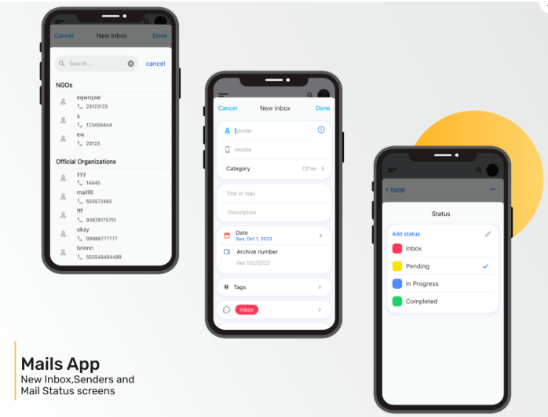
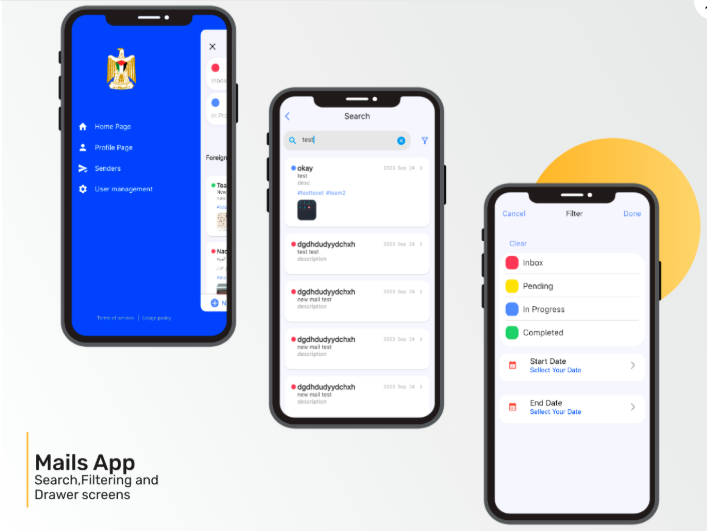
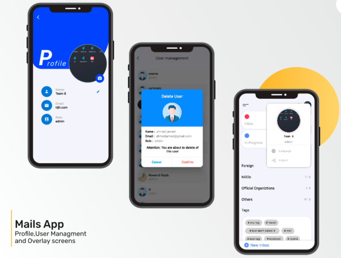
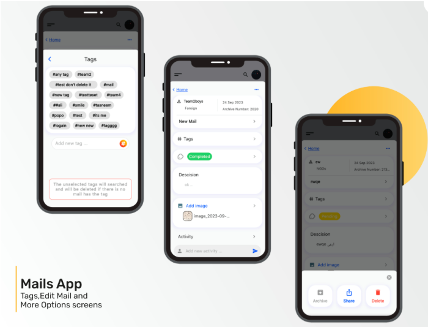
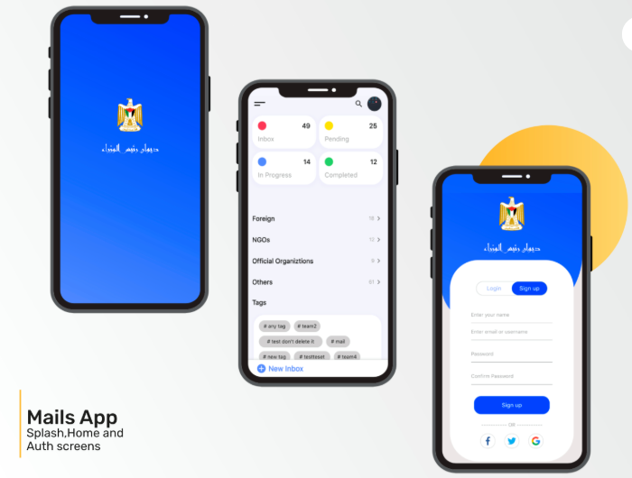

# 📬 Mails App

The Mails App is developed for the Prime Minister's Office to help manage the large volume of mails submitted by citizens. It provides a clean, efficient, and multi-language interface to organize, track, and manage incoming mails effectively.

---

## ✅ Features

1. **Friendly Home Page**
   - Displays the number of mails by:
     - 📂 **Category**
     - 📊 **Status**
     - 🏷️ **Common Tags**

   

2. **Easy Inbox Creation**
   - A floating action button allows quick creation of new mail entries with full details.

   

3. **Advanced Search & Filtering**
   - Filter mails by tag, status, date range, or keyword search.

   

4. **Senders Page**
   - Categorize senders (NGOs, Officials, Foreign) and access their mails easily.

   

5. **User Management**
   - Admin panel for managing users and assigning roles.

   

6. **Custom User Profile**
   - Each user has a dedicated profile page for personal settings and info.

   

7. **Multi-language Support**
   - 🌐 Supports both **Arabic** and **English** interfaces.

8. **Edit Incomplete Mails**
   - Mails that are still in progress can be easily edited and updated.

   

---

## 📲 Screenshots

| Splash & Auth | Home & Inbox | Search & Filter |
|---------------|--------------|-----------------|
|  |  |  |

| Profile & Users | Edit Mail | Senders |
|------------------|------------|---------|
|  |  |  |

---

## 🚀 Getting Started

```bash
git clone https://github.com/your-username/mails-app.git
cd mails-app
flutter pub get
flutter run
